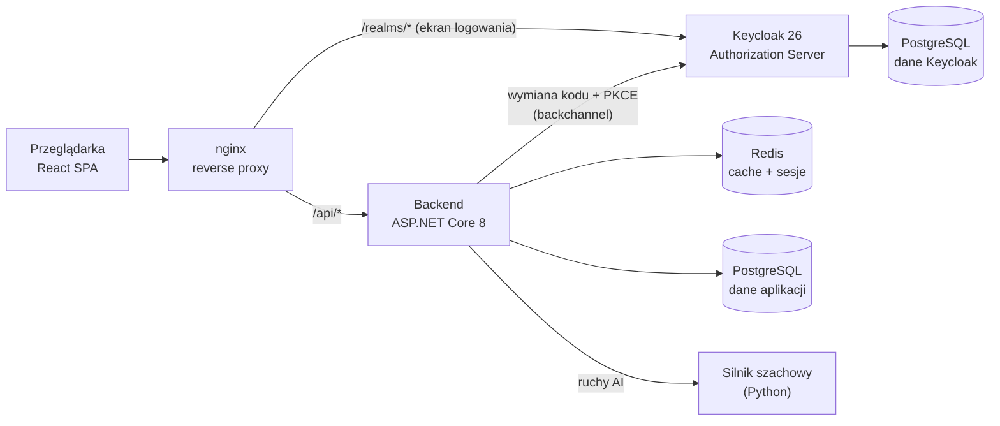
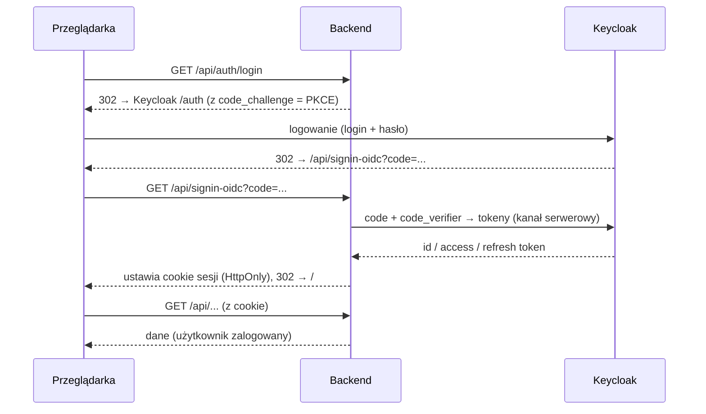

# ChessSite 
## Autor: Maciej Spławiński grupa 3

## Diagram usług


## Diagram przepływu logowania

## Opcja HTTPS
```
Aplikacja działa w pełni po http wewnętrznie.
Nginx posiada dwie konfiguracje w frontend/nginx dla http oraz https. W zmiennej środowiskowej
można zmienić wybraną konfiguracje a następnie użyć serwera reverse proxy obsługującego HTTPS.
```


## Jak uruchomić 

```bash
cp .env.example .env                 # hasła i sekrety
mkdir -p .secrets                    # 3 pliki (cf_* mogą być atrapą przy STORAGE_PROVIDER=Local)
echo "mojeHaslo"   > .secrets/db_password.txt
echo "x"           > .secrets/cf_access_key.txt
echo "x"           > .secrets/cf_secret_key.txt

docker compose -f  docker-compose.yml up --build -d           # start aplikacji
```

## Konto testowe (admin)

```
login: chessadmin    hasło: admin123    rola: admin
```

## Szybkie testy (curl)

```bash
curl -i http://localhost/api/health        # 200  – endpoint publiczny
curl -i http://localhost/api/auth/me        # 401  – chroniony, bez sesji
curl -i http://localhost/api/admin/users    # 401 403 200 bez sesji, bez roli, z sesja admina
```

## Przykładowe Endpointy

- **Publiczne:**
 `GET /api/health`, `GET /api/home/leaderboard`
- **Chronione (`[Authorize]`):** 
`GET /api/auth/me`, `GET /api/games`, całe `/api/users/*`
- **Na rolę (`[Authorize(Roles="admin")]`):** 
`GET /api/admin/users`, `GET /api/admin/stats`

## Deklaracja realmu keycloaka

```
keycloak/chess-realm.yaml
```


